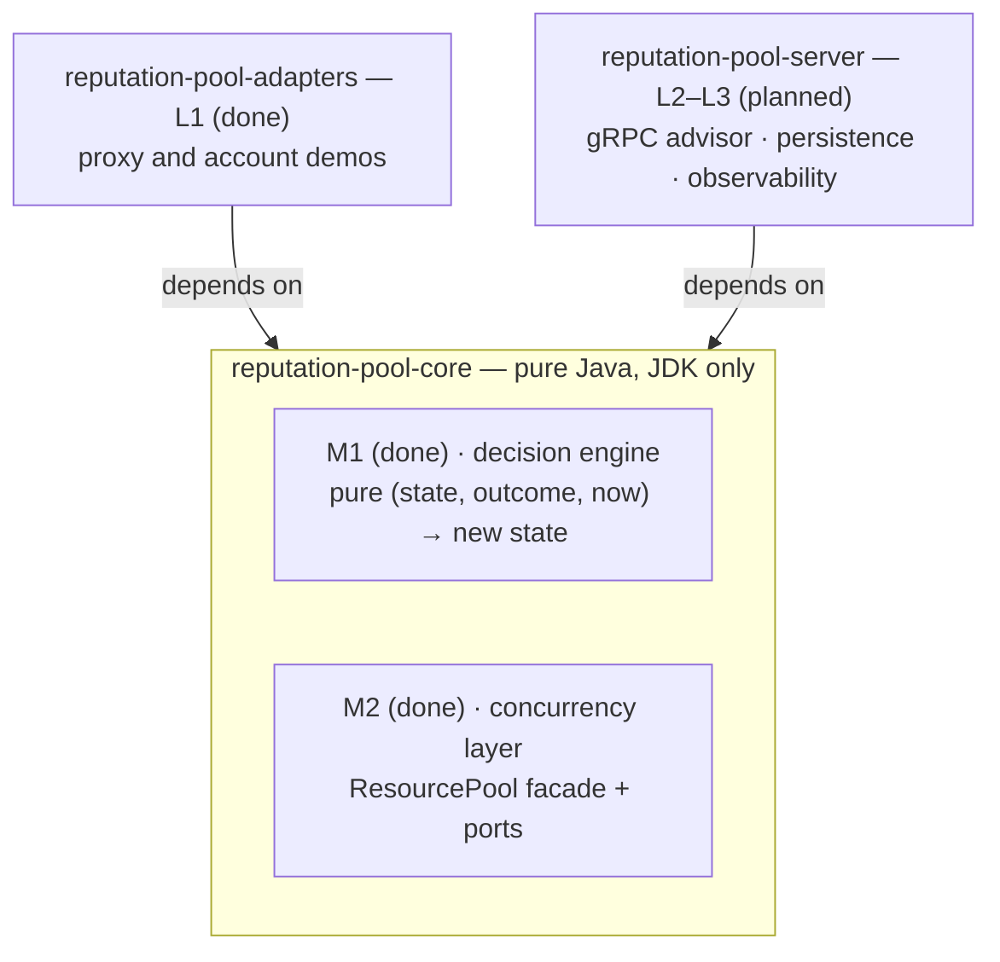

# Reputation Pool

A pure-Java engine for managing **leasable resources that carry a reputation** — proxy endpoints, external
accounts, browser sessions: anything you borrow, that degrades when it fails, cools down, and recovers.

The core makes one decision — *"may I lend this resource, for this context, right now?"* — as a **pure
function over immutable state**. It has **zero runtime dependencies** (JDK only): no Spring, no Netty, no
database, no network. Time, storage, health-probing, and observability are pushed behind four interfaces
(*ports*), so the same engine embeds as a library, fronts a gRPC service, or runs as a gateway — unchanged.

[](https://github.com/PreAgile/reputation-pool/actions/workflows/ci.yml)
[](LICENSE)
[](https://openjdk.org/projects/jdk/25/)

> **Status — early development.** `reputation-pool-core` (the pure decision engine) is published to Maven
> Central at `0.1.0`. The L1 adapters and the L2 gRPC advisor are done; L3 persistence is next. Layers are
> added as separate modules in this same repository — see the [roadmap](#roadmap) and
> [Design notes](#design-notes) for the full target architecture.

## Why

Reputation bugs leak slowly — a proxy that gets blocked on one platform quietly poisons the pool for every
platform, and logs don't catch it. This engine addresses that with three structural choices:

- **Decisions are pure functions.** `apply(cell, outcome, now) → next cell` has no side effects, so property
  tests can attack its invariants over thousands of generated outcome sequences, and a production incident
  reproduces by replaying the same inputs.
- **State is immutable and concurrency lives in the data.** A `ReputationCell` is an immutable record;
  updating it swaps a single reference, so readers never observe a torn state and atomicity comes from
  `ConcurrentHashMap.compute()` instead of distributed locks.
- **Purity is enforced by the build, not by discipline.** An ArchUnit rule rejects any `core → Spring / Netty
  / JDBC / gRPC` import as a build failure, so the dependency-free boundary is a fact CI guards, not a promise.

## Requirements

- **Java 25+** — the first LTS where virtual threads no longer pin the carrier thread inside `synchronized`
  ([JEP 491](https://openjdk.org/jeps/491)), which the health-prober layer relies on.

## Getting started

> Available on Maven Central. Requires [JDK 25+](#requirements). Or build from source (`./gradlew build`).

```kotlin
// build.gradle.kts
dependencies {
    implementation("io.github.preagile:reputation-pool-core:0.1.0")
}
```

A minimal embed — the whole M1 API is three calls:

```java
// windowSize 10, cool after 3 consecutive failures, promote back to HEALTHY
// after 2 consecutive post-cooldown successes
ReputationEngine engine = new ReputationEngine(new AdaptiveCooldownPolicy(), 10, 3, 2);

ReputationCell cell = ReputationCell.fresh(
        new ResourceId(ResourceKind.PROXY, "10.0.0.7:8080"),
        new Context("marketplace-a"),
        clock.instant()); // inject java.time.Clock — core never reads the wall clock itself

// report each use; apply is pure: (cell, outcome, now) -> next cell + events
ReputationEngine.Result result = engine.apply(
        cell, new Outcome.Failure(FailureType.TIMEOUT, Duration.ofSeconds(2)), clock.instant());
cell = result.cell();
result.events().forEach(this::publish); // ResourceCooled, ResourceRecovered, ...
```

## Core concepts

| Concept | What it is |
|---|---|
| **Resource** | Something you lease and that carries reputation — a proxy endpoint, an account, a session. |
| **Context** | The scope a reputation applies to (e.g. a platform). Failures in one context never affect another. |
| **Outcome** | The result of one use: `Success(latency)` or `Failure(type, latency)`. The engine's only input. |
| **ReputationCell** | One `(resource × context)` cell — score, consecutive failures, recent window, state, cooldown. Immutable. |
| **State** | `HEALTHY → COOLING → RECOVERING → HEALTHY`, plus `BLOCKLISTED`. Decides selectability. |

Effective score is two-layered: `effective = globalBase(resource) + contextDelta(resource, context)` — a
shared per-resource signal plus a per-context behavioural signal, so a block on one platform doesn't sink the
resource everywhere.

## Modules

| Module | Description | Status |
|---|---|---|
| `reputation-pool-core` | Pure decision engine — domain, engine, ports. JDK only. | In progress |
| `reputation-pool-adapters` | Demo resource kinds (proxy, account) implementing the ports. | Done |
| `reputation-pool-server` | Spring adapter ring — gRPC advisor done (L2); persistence, virtual-thread probing, and observability next (L3). | In progress |

## Architecture

The repository is one hexagon that grows outward from a pure core, and every dependency points **inward**:
an ArchUnit rule fails the build on any `core → Spring / Netty / JDBC / gRPC` import, so the dependency-free
boundary is guarded by CI, not by convention.



The roadmap labels encode that boundary:

- **M — milestones** build the pure core itself (`reputation-pool-core`: JDK-only, no I/O). `M1` is the
  decision engine; `M2` is the concurrency layer and the first port.
- **L — layers** are separate modules added *around* the core, where frameworks and real I/O are allowed.
  `L1` is the demo adapters, `L2` the gRPC server, `L3` persistence.

The line between them is exactly the module boundary the ArchUnit rule protects: code inside `core` stays a
pure function of its inputs, and everything that touches the network, a clock, or a database lives in an
`L` module that depends inward on `core` — never the other way around.

New to the project? [Concepts, flow, and vocabulary](docs/architecture/01-concepts-and-glossary.md) walks
through who-calls-whom and every term (lease, advisory, fencing token, EventSink, advisor, ...) in plain
language.

## Building from source

```bash
./gradlew build
```

`build` runs the full gate: Spotless formatting check, unit + property (jqwik) + concurrency tests, and the
ArchUnit purity rules. The build provisions JDK 25 automatically via the Foojay toolchain resolver.

## Roadmap

- [x] **M1 — core decision engine**: domain records, `ReputationEngine`, `AdaptiveCooldownPolicy`; jqwik
      invariants + ArchUnit purity gate.
- [x] **M2 — concurrency layer**: `Blocklist`, `SelectionStrategy`, `LeaseRegistry`, `ResourcePool` facade,
      and the first `EventSink` port; 32-thread lease-exclusivity tests.
- [x] **L1 — adapter demos**: proxy and account adapters driven by the same engine — per-kind outcome
      classifiers and WireMock end-to-end cooling/recovery tests.
- [x] **L2 — gRPC advisor**: `acquire / report / renew / release` + event stream; publish core to Maven Central.
- [ ] **L3 — persistence**: snapshot + audit trail behind the `ResourceStore` port.

## Design notes

The full target architecture (state machine, two-layer reputation model, gRPC contract, storage design, SLOs)
lives in the design documents. This repository grows outward from `core`; each layer is optional and the story
is complete at every stopping point.

## License

Licensed under the [Apache License 2.0](LICENSE).
