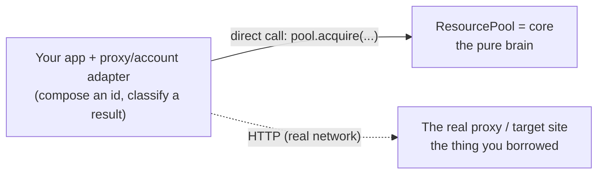
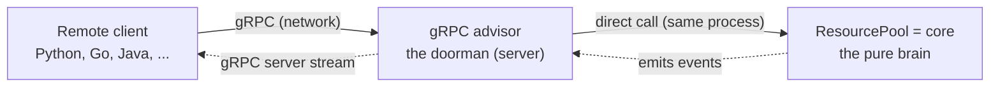

# Concepts, flow, and vocabulary

A plain-language guide to how `reputation-pool` is put together and every term you will meet reading
the code or the roadmap. If something in the README or a design doc read like jargon, it is defined
here — with an analogy and its concrete role in this project.

## What the system does, in one sentence

It is a **brain for things you borrow** — proxy endpoints, external accounts, browser sessions. When a
borrowed thing fails, the brain lets its reputation drop so it **cools down** (stops being handed out for
a while); when time passes, it **recovers**. That brain is `reputation-pool-core`. Everything else is a
question of *how you let callers use the brain*.

## The big picture — who calls whom

The core never reaches out to the world; the world reaches *in* to the core. There are two ways to reach
in, and they matter for understanding the roadmap labels (`L1`, `L2`).

### In-process (L1): same program, direct method calls

*In-process* means the caller and the core run in the **same JVM**, so calling the core is just a Java
method call — `pool.acquire(context)` — with **no network involved**. The only place HTTP appears is
where the proxy adapter actually *uses* (probes) the proxy it borrowed. In the tests, WireMock stands in
for that **target site**, not for the core.

> **The core is never reached over HTTP in L1.** If you want it reachable over the network, that is what
> L2 adds.

### Remote (L2): another program, another language, over the network

The **advisor** and the **core** live in the *same server process*. The advisor receives a network
request, **translates** it into a core method call, and translates the result back. Separately, the core
emits events (a resource cooled, recovered, ...) and the advisor pushes them to any subscribed clients.

## Three things that are easy to get wrong

- **"Is the flow advisor -> adapter -> core?"** No. The flow is **client -> advisor -> core** (advisor and
  core share one process). The L1 proxy/account adapters are *not* a middle step in that chain — they are
  a **separate translator** for "what a resource is and how to score a result," usually used on the client
  side. The advisor is itself an adapter, but a different one (the network doorman).
- **"Does the advisor decide which communication to use?"** No. What the advisor *advises* is **which
  resource to use** (`acquire`), not a communication method. gRPC is *what the advisor is*, not what it
  advises.
- **"Is in-process the same as calling the core over HTTP?"** No. **In-process = no network = a method
  call in the same JVM.** HTTP shows up only where the proxy adapter probes the borrowed proxy. Reaching
  the core over the network is precisely why L2 exists.

## Vocabulary

### Communication and structure

**Polyglot typed client** — client code generated in many languages from one contract (`.proto`), with
types baked in. *Analogy:* one blueprint, and the factory stamps out a Python remote, a Go remote, a Java
remote. Instead of hand-building JSON strings you call `advisor.acquire(context)` and the compiler catches
your typos. *Here:* the pool advises apps written in different languages, so one `.proto` producing every
language's client is exactly what gRPC gives.

**The four operations** — `acquire` / `report` / `renew` / `release`, the core facade's (`ResourcePool`)
main verbs. *Here:* **acquire** = borrow one resource, **report** = tell the pool how the use went
(success/failure), **renew** = extend the borrow, **release** = give it back. "Expose them over gRPC"
means: let a remote caller invoke these four. (`register` / `block` / `unblock` are supporting verbs.)

**EventSink** — the port (interface) where the core's *events* flow out. The core only emits facts — "X
cooled," "X recovered," "X leased" — and an implementation decides what to do with them. *Analogy:* a sink
drain. The core pours events down it; the plumbing (the implementation) decides where they go. *Here:*
two implementations — `Slf4jEventSink` (write to a log, L1) and a streaming one (push to subscribers, L2).
The core does not know which is plugged in, so no logging or streaming technology leaks into it.

**Event stream** — a flow of events that keeps arriving after a single subscription, rather than one
request -> one response. *Analogy:* request/response is asking a question and getting one answer; a stream
is leaving the radio on — it keeps broadcasting. *Here:* a client opens one "subscribe" stream and keeps
receiving every state transition the pool makes.

**SSE / WebSocket** — technologies you must add on top of REST to get server-to-client push, because plain
REST is request/response only. *Analogy:* REST is a vending machine (press a button, get one item); to get
a broadcast you bolt on a separate speaker (SSE/WebSocket). gRPC has the vending machine and the speaker in
one box. *Here:* with REST, the four operations would be the vending machine and the event stream a
bolted-on speaker — two technologies; gRPC does both, which is why it was chosen.

**Anti-Corruption Layer (ACL) / mapper** — a translation layer that stops a foreign, messy model (the
classes gRPC auto-generates) from *corrupting* the clean domain model inside. *Analogy:* an airport
interpreter. Foreign words (proto messages) arrive; the interpreter (mapper) turns them into our language
(domain objects like `ResourceId`, `Outcome`) before they enter the meeting room (the core). The foreign
words never reach the core. *Here:* a `ProtoMapping` translates proto <-> domain both ways. If a generated
proto class leaked into the core, the "core = JDK only" rule would break — so this translation is required,
not decorative.

**Advisor** — the role name of the server: it does **not use** resources itself; it *advises* ("use this
one," `acquire`) and takes *feedback* ("that one failed," `report`). *Analogy:* a librarian. They do not
read the book for you; they tell you which book is available and note when one is in bad shape, so the next
reader benefits. *Here:* the decisions (which resource, how long to cool) live in the core; the advisor is
the thin layer that exposes those decisions over the network.

### Leasing and its limits

**Lease** — a **time-bounded loan** of a resource: "this is yours, from now until it expires." *Analogy:*
a library loan with a due date. acquire = check out, `expiresAt` = due date, renew = extend, release =
return. *Here:* the `Lease(resource, context, token, leasedAt, expiresAt)` record; you must hold it to
renew or release.

**Advisory (lock)** — a lock that only works because everyone *agrees* to respect it; it is not physically
enforced. *Analogy:* a "Reserved" sign on a meeting room — it cannot physically stop someone who ignores it;
it works only when people honor it. *Here:* the pool hands out one lease for a resource, but it cannot
physically stop a caller from using that proxy without a lease. So the lease is advisory.

**Coordination** — getting several parties to *agree on who the legitimate holder is right now*, as opposed
to *physically preventing* anyone else. *Analogy:* a traffic light. It does not grab your car; everyone
reads it and takes turns. Running the light is possible, but the system makes "whose turn it is"
unambiguous. *Here:* what the pool guarantees is not "physical simultaneous use <= 1" but "active lease
<= 1" — that is coordination. Physical exclusivity is impossible in a distributed system, so coordination
is the honest limit.

**Fencing token** — a number handed out with each lease that **only increases**, used to *fence off* a
stale holder. *Analogy:* a bank ticket number that cannot go backwards. If customer #5 dozes off and shows
up late shouting "my turn!", the counter is already calling #7 — #5 is ignored. Because numbers only go up,
an old number is automatically invalid. *Here:* the lease's monotonically increasing `token`. After A's
lease expires and B gets a new lease (a higher token), a late `release`/`renew` from A carries the *old*
token and is rejected — so it cannot disturb B's lease.

**TTL / renew** — **TTL** (time-to-live) is how long a lease stays valid before it is auto-reclaimed;
**renew** extends it because you are still using the resource. *Analogy:* a parking meter — TTL is the time
you paid for, renew is feeding in more coins; when it runs out, someone else can take the spot. *Here:* TTL
is a **crash safety net** — if the borrower dies without returning the lease, it is still reclaimed. Normal
return is `release`; a live holder keeps extending with `renew`.

## Milestones (M) vs layers (L)

The roadmap labels encode a single boundary — *inside the pure core, or a module around it*:

- **M — milestones** build the pure core itself (`reputation-pool-core`: JDK-only, no I/O). `M1` is the
  decision engine; `M2` is the concurrency layer and the first port.
- **L — layers** are separate modules added *around* the core, where frameworks and real I/O are allowed.
  `L1` is the demo adapters, `L2` the gRPC server, `L3` persistence.

The dividing line is exactly the module boundary the ArchUnit rule guards: code inside `core` stays a pure
function of its inputs; anything that touches the network, a clock, or a database lives in an `L` module
that depends *inward* on `core`, never the other way around.

## "It is my own rule — why call it *enforced*?"

Fair question: the ArchUnit purity rule was written by the project's authors, so "enforced" does not mean
"someone forced us." It means something more useful:

1. A principle is stated once, explicitly — *"`core` depends only on the JDK."*
2. Instead of *hoping* everyone remembers it, that principle is encoded as an **executable rule the build
   checks** (ArchUnit).
3. From then on, no one re-argues it file by file — a violating import turns the build red.

So "enforced" means **a constraint we chose, then made binding on ourselves** (self-imposed, then
mechanically checked). That is what makes it a stronger footing than taste: the answer to *"why is gRPC
not in the core?"* is not "a preference," but "it follows from a stated principle — pure functions,
testable invariants, reproducible incidents — that we made impossible to erode, even for our future selves."
